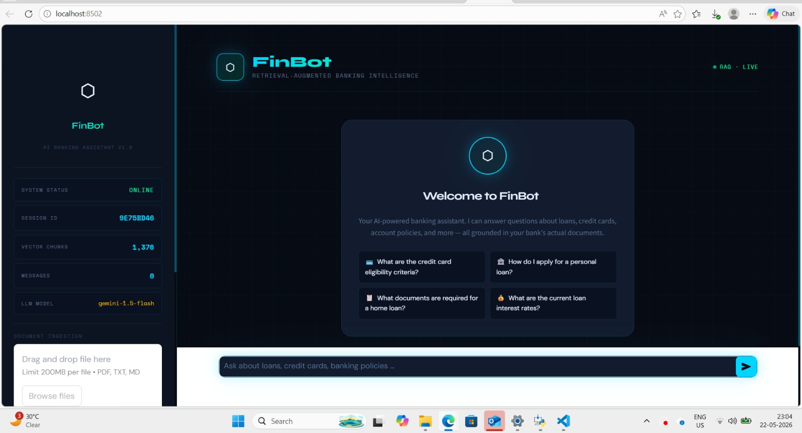

# FinBot — AI Banking Support Chatbot

FinBot is a Retrieval-Augmented Generation (RAG) powered AI banking assistant built using FastAPI, ChromaDB, Sentence Transformers, Gemini API, and Streamlit.

The chatbot answers banking-related queries using real banking documents such as:
- RBI guidelines
- Loan policy documents
- Credit card terms & conditions
- Banking FAQs
- Digital banking documentation

---




# Features

- RAG (Retrieval-Augmented Generation)
- ChromaDB Vector Database
- Semantic Search
- PDF/TXT Document Ingestion
- Gemini 1.5 Flash Integration
- Session-based Conversational Memory
- FastAPI Backend
- Streamlit Frontend
- Source Attribution
- Upload New Documents Dynamically
- Banking-focused AI Assistant

---

# Tech Stack

## Backend
- FastAPI
- Uvicorn
- LangChain
- ChromaDB
- Sentence Transformers
- Google Gemini API

## Frontend
- Streamlit

## Embedding Model
- all-MiniLM-L6-v2

## Vector Database
- ChromaDB

---

# Project Structure

```text
banking-chatbot/
│
├── backend/
│   ├── __init__.py
│   ├── config.py
│   ├── main.py
│   ├── models.py
│   ├── rag_pipeline.py
│   ├── ingest.py
│   └── requirements.txt
│
├── frontend/
│   └── app.py
│
├── data/
│   └── banking PDFs and TXT files
│
├── chroma_db/
│
├── .env
├── .gitignore
├── README.md
└── render.yaml
```

---

# How RAG Works

```text
PDF Documents
      ↓
Document Ingestion
      ↓
Text Chunking
      ↓
Embedding Generation
      ↓
ChromaDB Vector Storage
      ↓
Semantic Retrieval
      ↓
Gemini LLM
      ↓
Final AI Response
```

---

# Setup Instructions

## 1. Clone Project

```bash
git clone <your-repository-url>
cd banking-chatbot
```

---

## 2. Create Virtual Environment

```bash
python -m venv venv-py312
```

Activate virtual environment:

### Windows

```bash
venv-py312\Scripts\activate
```

---

## 3. Install Dependencies

```bash
pip install -r backend/requirements.txt
```

---

# Environment Variables

Create `.env` in root directory:

```env
GEMINI_API_KEY=your_gemini_api_key
GEMINI_MODEL=gemini-1.5-flash
```

---

# Add Banking Documents

Place all PDFs/TXT files inside:

```text
data/
```

---

# Ingest Documents Into ChromaDB

Run:

```bash
python -m backend.ingest
```

---

# Run Backend Server

```bash
python -m uvicorn backend.main:app --reload
```

Backend runs on:

```text
http://localhost:8000
```

Swagger Docs:

```text
http://localhost:8000/docs
```

---

# Run Streamlit Frontend

Open new terminal:

```bash
venv\Scripts\activate
```

Run frontend:

```bash
python -m streamlit run frontend/app.py
```

---

# API Endpoints

## Health Check

```http
GET /health
```

## Chat Endpoint

```http
POST /chat
```

## Upload Document

```http
POST /upload
```

---

# Example Questions

- What is KYC?
- What documents are required for a home loan?
- What are credit card late payment charges?
- Explain RBI banking regulations.
- How does mobile banking work?
- What is the minimum balance requirement?

---

# Author

AI-powered Banking Support Chatbot using RAG Architecture.


Create `.env` from `.env.example` and add your Gemini API key:

```env
GEMINI_API_KEY=your_gemini_api_key_here
GEMINI_MODEL=gemini-2.5-flash
```

Ingest the documents:

```powershell
python -m backend.ingest
```

Run the backend:

```powershell
uvicorn backend.main:app --reload
```

Run the frontend in another terminal:

```powershell
streamlit run frontend\app.py
```

## Deployment Notes

Do not commit `.env`, `venv/`, `venv-py312/`, or `chroma_db/`. Configure `GEMINI_API_KEY` as an environment variable on your hosting provider.

### Render Backend

This repository includes `render.yaml` for deploying the FastAPI backend on Render.

Required Render environment variable:

```env
GEMINI_API_KEY=your_real_gemini_key
```

After deploy, open:

```text
https://your-render-service.onrender.com/health
https://your-render-service.onrender.com/docs
```

### Streamlit Frontend

Deploy `frontend/app.py` on Streamlit Community Cloud and point it at the Render backend.

Streamlit app settings:

```text
Repository: Anuragsharma31-2003/projectbanking
Branch: main
Main file path: frontend/app.py
```

Streamlit secrets:

```toml
BACKEND_URL = "https://your-render-service.onrender.com"
```

Only set `GEMINI_API_KEY` on Render. The Streamlit frontend should only know the backend URL.
